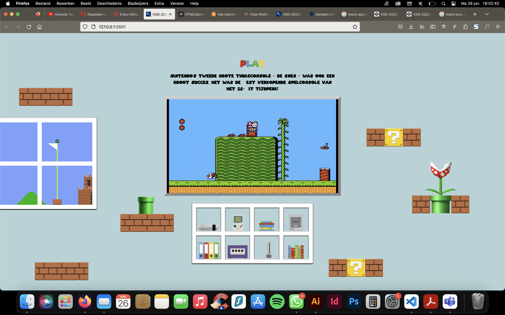
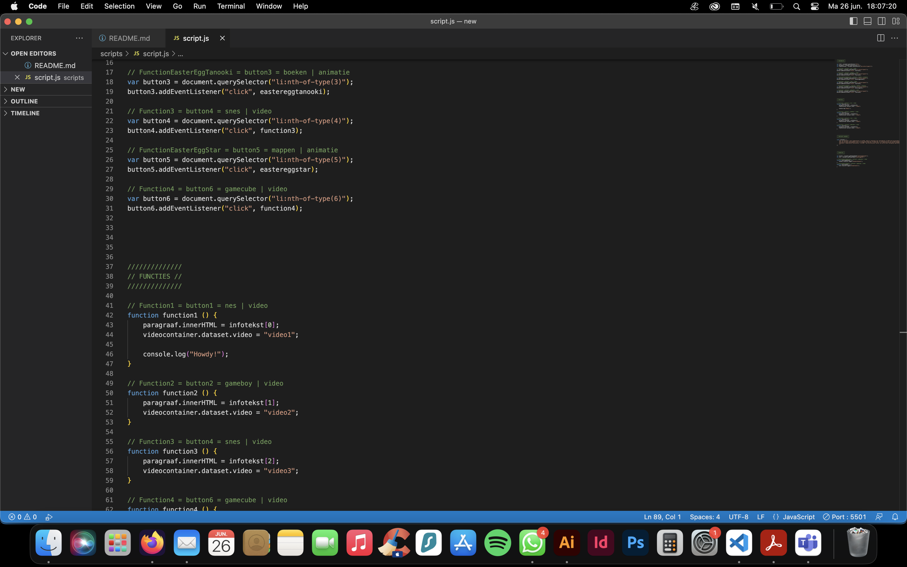

# Procesverslag
Markdown is een simpele manier om HTML te schrijven.  
Markdown cheat cheet: [Hulp bij het schrijven van Markdown](https://github.com/adam-p/markdown-here/wiki/Markdown-Cheatsheet).

Nb. De standaardstructuur en de spartaanse opmaak van de README.md zijn helemaal prima. Het gaat om de inhoud van je procesverslag. Besteedt de tijd voor pracht en praal aan je website.

Nb. Door *open* toe te voegen aan een *details* element kun je deze standaard open zetten. Fijn om dat steeds voor de relevante stuk(ken) te doen.

## Jij

### Ontwerper:
Nadia Molenaar

#### Je startniveau:
Nog steeds blauw, maar licht overlappend met rood, omdat ik inmiddels de taal wel spreek, begrijp en duidelijk kan toelichten.

# Je plan

  
Mijn persoonlijke uitdaging ligt bij JS. Hierin wil ik mezelf meer ontwikkelen. Verder wil ik ook kijken naar de mogelijkheden met grid.
  
  Op mijn schets is een gameroom te zien. Iemand heeft de slaapkamer in stijl van Mario Bros gemaakt. Een game speel je vaak op groot scherm, maar om een game te spelen moet je op een button klikken. In ieder vak van de kast verschuilt zich een video (of easter egg) met informatie.

  ### De eerste versie/schets:
  

  ### Je ambitie: 
  Aan deze technieken/punten wil ik werken:
  - Grid
  - JS functies
  - Video's implementeren
 

## Voortgang/Feedback 1

  
Mijn bevindingen + wijzigingen (minimaal 5)

  ### Bevinding 1:
  Het bedenken van een concept vond ik erg lastig, daardoor duurde het langer om iets op papier te zetten.

  #### Oplossing:
  Na enige inspiratie heb ik besloten een racecircuit uit mario kart te maken.

  

  ### Bevinding 2:
  Tijdens de feedback sessie kwam ik erachter dat er best wat mensen hetzelfde idee hadden.. Dit vond ik best jammer en daarom heb ik besloten mijn idee aan te passen. 

  #### Oplossing:
  Mario Kart is een super bekende game en aan de hand daarvan heb ik een nieuw concept gemaakt: de gameroom. Dit is de schets bovenaan in de readme. 

  ### Bevinding 3:
  Starten met HTML/CSS vind ik altijd lastig, waar begin je?! Een standaard stress moment voor mij...  

  ### Oplossing:
  Met die reden heb ik gewoon de basiswebsite gevuld met de belangrijkste elementen: een 'ondertitel, de video's en de buttons.

  

  ### Bevinding 4:
  Verder kreeg ik nog de feedback even na te denken over hoe de besturing met toetenbord toegevoegt kan worden aan het concept.

  ### Oplossing:
  Door middel van buttons wordt het concept beschikbaar voor toetsenbord besturing.

## Voortgang/Feedback 2

  
Mijn bevindingen + wijzigingen (minimaal 5)

  
  ### Bevinding 1:
  Om ervoor te zorgen dat mijn tv en kast netjes uitgelijnd staan en een beetje responsive kunnen worden heb ik een grid toegepast. Dit werkte aldoor niet, na verschillende dingen geprobeerd te hebben - en het nog altijd niet werkte - heb ik hulp gevraagd. 

  #### Oplossing:
  Blijkbaar was ik al aardig op de goede weg, maar stond het grid niet op de juiste elementen van de html. Onderstaande code is de oplossing voor het goed functioneren van het grid. 

  

  ### Bevinding 2:
  Een ander probleem waar ik aldoor tegenaan liep was dat de video's wel getoond werden, maar vervolgens niet afgespeeld. In JS had ik al een aantal dingen geprobeerd, waaronder het toggelen van de elementen, maar dat was tevergeefs.

  #### Oplossing:
  Met hulp heb ik een nieuwe functie gemaakt die aan de hand van een if/else statement zorgt voor het afspelen en pauzeren van de betreffende video.

  

  ### Bevinding 3:
  Tijdens het testen van mijn website vanuit github stuitte Luna erop dat mijn site niet goed werkt. Afbeeldingen en fonts worden niet goed ingeladen... 

  ### Oplossing:
  Door het opnieuw uploaden van al mijn elementen & folders en het even wat meer tijd te geven om te updaten werd alles daarna goed geladen. 

## Voortgang/Feedback 3

  
Mijn bevindingen + wijzigingen (minimaal 5)

  
  ### Bevinding 1:
  De buttons waren echt nog buttons, gewoon vierkante knoppen waar je op kunt klikken.

  #### Oplossing:
  De buttons heb ik gewijzigd naar vaste nintendo game consoles, zoals de (s)nes, N64 en WII.

  ### Bevinding 2:
  Het grid had ik een losse stylesheet geplaats, tijdens de feedback kreeg ik terug dat dit eigenlijk niet zo handig is en dat het er ook mooier uit zou zien als deze wordt toegevoegd aan de bestaande stylesheet met alle andere elementen.

  

  #### Oplossing:
  Het grid heb ik in de algemene stylesheet geplaatst, maar ipv de breedte op 40em te zetten, heb ik deze gewijzigd naar 35vw. Dit paste uiteindelijk mooier in het concept! 

  

  ### Bevinding 3:
  Tijdens de feedback kreeg ik terug dat mijn website nog niet erg responsive was.

  ### Oplossing:
  In de CSS heb ik de width aangepast, waardoor hij nu steeds een vast, maar vooraf bepaald deel van de bestaande pagina inneemt. 

  ### Bevinding 4:
  Mijn fonts werkten niet goed op een andere computer...

  ### Oplossing:
  Door de fonts opnieuw te uploaden en dit wat langer de tijd te geven werkte het wel.
  
  

## Reflectie

  
Mijn eindresultaat & persoonlijke ontwikkeling

  ### Je uitkomst - karakteristiek screenshot(s):
  

  ### Dit ging goed/Heb ik geleerd: 
  Het ging me goed af om met CSS de styling te doen! Ik heb gemerkt dat de voorgaande ervaring hiermee echt heeft bijgedragen aan het sneller, maar ook makkelijker kunnen 'opsommen' van alle properties. Uiteindelijk heb ik geleerd hoe ik JS op een goede manier kan gebruiken. Een van mijn leerdoelen was ook om de functies van JS beter onder de knie te krijgen. Met een klein beetje hulp op een script die ik zelf al had geschreven is het mij gelukt om video's af te kunnen spelen, met daarbij een passende tekst die steeds veranderd zodra er een andere video wordt afgespeeld. Verder heb ik geleerd dat werk gevoelsmatig nooit af is... Steeds weer popt er een nieuw idee op die ik wil uitwerken, maar waar ik helaas nog niet gevorderd genoeg voor ben. Ondanks dat heb ik behoorlijke sprongen gemaakt en gaan de dingen met meer ease dan ze deden aan het begin van het vak!

  

  ### Dit was lastig/Is niet gelukt:
  Helaas is het mij niet gelukt om video's te kunnen pauzeren... Het was nog wel een doel om dit zelfstandig te kunnen, maar ik heb hierdoor ook geleerd om tevreden te zijn met mijn werk, ook als het niet lukt! Het kan niet altijd perfect zijn en ik heb door het doen, fouten te maken en dingen die simpelweg niet lukken - ongeacht het onderzoek - geleerd dat het ook oke is om ergens minder goed in te zijn en dat ook te accpeteren. Inmiddels vind ik code leuker dan ik eerst had verwacht, hoewel ik er toch met regelmaat nog wel moeite mee heb. 

  

## Bronnenlijst

continu bijhouden terwijl je werkt

Nb. Wees specifiek ('css-tricks' als bron is bijv. niet specifiek genoeg).

1. Flexbox              - https://css-tricks.com/snippets/css/a-guide-to-flexbox/
2. Grid                 - https://css-tricks.com/snippets/css/complete-guide-grid/
3. CSS selects          - https://www.w3schools.com/cssref/css_selectors.php & https://developer.mozilla.org/en-US/docs/Web/CSS
4. Lettertypes omzetten - https://www.fontsquirrel.com/

